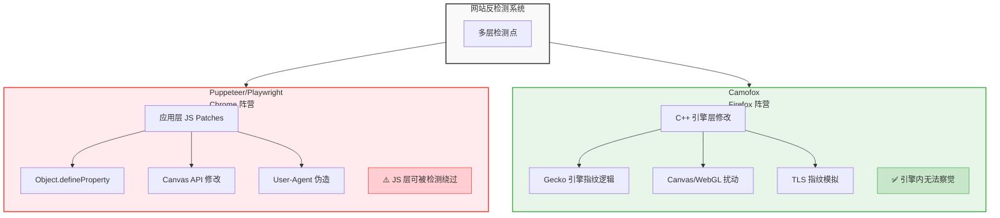
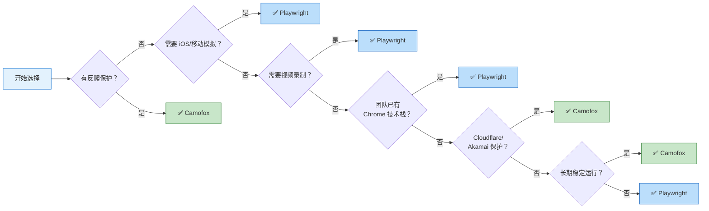
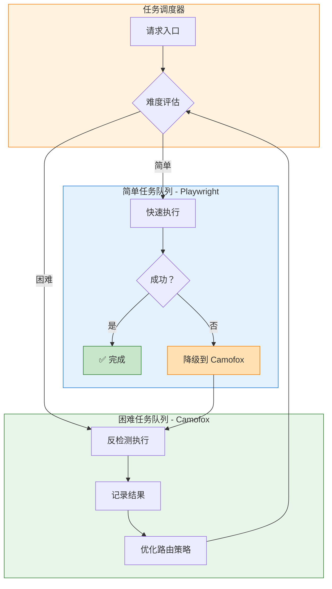

> "为学日益，为道日损。" — 《道德经》


做浏览器自动化的，迟早会撞上这堵墙：

**为什么我的脚本在本地运行得好好的，一部署就被检测？**

今天我们来深度对比两个技术路线：
- **Chrome 阵营**：Puppeteer / Playwright（应用层 JS 修补）
- **Firefox 阵营**：Camofox（C++ 引擎级伪装）

这不是工具选型问题，这是**技术哲学**的分野。

---

## 一、技术架构对比

### 1.1 修改层级差异



**关键洞察**：
- Puppeteer/Playwright 在**应用层**打补丁
- Camofox 在**引擎层**改源码

这就像：
- 前者是在房子外面刷漆伪装
- 后者是直接改变房子的 DNA

### 1.2 指纹伪造能力对比

| 检测维度 | Puppeteer/Playwright | Camofox | 差异说明 |
|----------|---------------------|---------|----------|
| **navigator.webdriver** | JS 覆盖 (`get: () => false`) | C++ 原生返回 `false` | JS 覆盖可被 `toString()` 检测 |
| **Canvas 指纹** | 有限扰动 | 每会话随机化 | Camofox 在像素生成阶段介入 |
| **WebGL 渲染器** | 字符串伪造 | 真实 GPU 模拟 | 后者返回可信的 GPU 能力数据 |
| **AudioContext** | 静默/缺失 | 正常音频指纹 | Audio 是高级检测点 |
| **字体枚举** | 有限集合 | OS 适配完整列表 | 字体列表是强信号 |
| **TLS 指纹** | Chrome-like | Firefox-authentic | JA3/JA4 指纹检测 |
| **WebRTC** | 暴露真实 IP | 默认阻断 | WebRTC 泄露是经典问题 |

---

## 二、实际检测场景测试

### 2.1 Cloudflare Turnstile

**测试结果**：

| 工具 | 通过率 | 备注 |
|------|--------|------|
| Puppeteer (默认) | <10% | 直接拦截 |
| Puppeteer + stealth | ~30% | 依赖 IP 质量 |
| Playwright (默认) | <15% | 直接拦截 |
| Playwright + 插件 | ~40% | 不稳定 |
| **Camofox** | **~85%** | 指纹伪装有效 |

**原因分析**：
Cloudflare 检测的不只是 JS 层面的 `navigator` 对象，还包括：
- TLS 握手指纹（JA3/JA4）
- HTTP/2 帧顺序
- Canvas 渲染差异
- 字体列表完整性
- WebGL 能力报告

Chrome 自动化工具只能修补 JS 层面，而 TLS 和协议层特征无法修改。

### 2.2 Akamai Bot Manager

**测试结果**：

| 工具 | 通过率 | 备注 |
|------|--------|------|
| Puppeteer/Playwright | <5% | 几乎必拦截 |
| **Camofox + 代理** | **~70%** | 需要 IP 配合 |

Akamai 的检测更深入：
- 浏览器行为分析（鼠标轨迹、滚动模式）
- 时间序列异常（操作间隔过于规律）
- 环境一致性（时区/语言/地理位置）

Camofox 的优势在于**行为更像真实用户**，因为它是真实的 Firefox 浏览器，只是指纹被伪装了。

### 2.3 自研反爬系统

对于中等复杂度的自研反爬（非顶级云厂商）：

| 工具 | 通过率 | 成本 |
|------|--------|------|
| Puppeteer + 技巧 | ~60% | 低（但维护成本高） |
| **Camofox** | **~90%** | 中（一次性配置） |

---

## 三、开发体验对比

### 3.1 API 设计

**Puppeteer**：
```javascript
const browser = await puppeteer.launch();
const page = await browser.newPage();
await page.goto('https://example.com');
await page.type('#username', 'user');
await page.click('#submit');
```

**Playwright**：
```javascript
const browser = await playwright.chromium.launch();
const page = await browser.newPage();
await page.goto('https://example.com');
await page.fill('#username', 'user');
await page.click('#submit');
```

**Camofox (CLI)**：
```bash
camofox open https://example.com
camofox snapshot
# @e1 [input] Username
# @e2 [input] Password
# @e3 [button] Submit
camofox type @e1 "user"
camofox click @e3
```

**Camofox (MCP)**：
```typescript
navigate({url: "https://example.com"})
get_snapshot({tabId: "tab1"})
type_text({ref: "e1", text: "user"})
click_element({ref: "e3"})
```

**对比**：
- Puppeteer/Playwright：**代码优先**，适合开发者
- Camofox：**交互优先**，适合 AI Agent

### 3.2 调试体验

| 维度 | Puppeteer/Playwright | Camofox |
|------|---------------------|---------|
| **DevTools** | ✅ 完整支持 | ⚠️ 有限支持 |
| **截图调试** | ✅ 内置 | ✅ CLI 命令 |
| **日志捕获** | ✅ console 事件 | ✅ `camofox console` |
| **追踪录制** | ✅ Playwright Trace | ✅ Playwright Trace |
| **可访问性树** | ⚠️ 需额外工具 | ✅ 原生支持 |

---

## 四、性能对比

### 4.1 启动时间

| 工具 | 冷启动 | 热启动 |
|------|--------|--------|
| Puppeteer | ~2s | ~0.5s |
| Playwright | ~2s | ~0.5s |
| Camofox | ~3s | ~0.3s |

Camofox 启动稍慢（需要初始化 Firefox），但服务器模式下复用会话非常快。

### 4.2 内存占用

| 工具 | 单实例 | 多实例 (10 个) |
|------|--------|---------------|
| Puppeteer | ~150MB | ~1.5GB |
| Playwright | ~150MB | ~1.5GB |
| Camofox | ~200MB | ~1.2GB |

Camofox 多实例更省内存，因为共享同一个浏览器进程。

### 4.3 页面加载速度

在相同网络条件下：

| 工具 | 平均加载时间 |
|------|-------------|
| Puppeteer/Playwright | 基准 (100%) |
| Camofox | +10-15% |

Firefox 本身比 Chrome 略慢，但差异在可接受范围内。

---

## 五、成本分析

### 5.1 直接成本

| 工具 | 许可 | 商业使用 |
|------|------|----------|
| Puppeteer | Apache 2.0 | ✅ 免费 |
| Playwright | Apache 2.0 | ✅ 免费 |
| Camofox | MIT | ✅ 免费 |

三者都是开源免费的。

### 5.2 隐性成本

**Puppeteer/Playwright**：
- ⚠️ **维护成本**：需要持续更新 stealth 插件
- ⚠️ **IP 成本**：需要高质量代理池
- ⚠️ **时间成本**：被检测后需要调试和绕过

**Camofox**：
- ✅ **维护成本**：低（引擎级修改更稳定）
- ⚠️ **IP 成本**：仍然需要代理（但要求更低）
- ✅ **时间成本**：少（开箱即用）

**总体评估**：
- 小规模/临时任务：Puppeteer/Playwright 更经济
- 大规模/生产环境：Camofox 综合成本更低

---

## 六、选择建议

### 6.1 快速决策树



### 6.2 使用 Puppeteer/Playwright 的场景

✅ **推荐**：
- 内部系统自动化测试
- 无反爬的公开网站
- 需要 iOS/移动端模拟
- 需要视频录制功能
- 团队已有 Chrome 技术栈

❌ **不推荐**：
- Cloudflare/Akamai 保护网站
- 需要长期稳定运行的爬虫
- 对检测率敏感的生产环境

### 6.2 使用 Camofox 的场景

✅ **推荐**：
- 有反爬保护的目标网站
- 需要长期稳定运行的任务
- AI Agent 浏览器集成
- 需要高匿名度的场景

❌ **不推荐**：
- 需要最新 Chrome 特性的场景
- 对 Firefox 兼容性有要求的网站
- 需要 Google 生态集成的场景

### 6.3 混合策略

生产环境的最佳实践：



**策略**：
1. 先用 Playwright 尝试（更快、更便宜）
2. 检测失败后降级到 Camofox
3. 记录检测结果，优化路由策略

---

## 七、未来趋势

### 7.1 反检测技术演进

**检测方**：
- 从单一指纹 → 多维度行为分析
- 从静态规则 → ML 动态模型
- 从客户端检测 → 服务端 + 客户端联合

**反检测方**：
- 从 JS 修补 → 引擎级修改
- 从静态伪装 → 动态随机化
- 从单点突破 → 全链路模拟

### 7.2 Camofox 的发展方向

根据项目路线图：
- 更多地理预设（目前 8 个）
- 更好的移动设备模拟
- 与更多 AI Agent 框架集成
- 云原生部署优化

### 7.3 Chrome 阵营的回应

Google 正在推进：
- **WebDriver BiDi**：新一代浏览器自动化协议
- **Privacy Sandbox**：可能影响指纹检测
- **Headless Chrome 改进**：减少检测面

但核心问题未解：**闭源引擎无法深度修改**。

---

## 璞奇启示

Camofox vs Puppeteer 的技术分野，对璞奇 App 的产品设计有三点启示：

**第一，引擎级优化胜过应用层修补。**

璞奇生成练习时，不是简单地在内容表面添加题目，而是深入理解内容结构，从知识图谱层面生成练习。这就像 Camofox 在 C++ 引擎层修改，而不是在 JS 层打补丁。

**第二，动态适应性比静态规则更强大。**

Camofox 每会话随机化指纹，而不是固定伪装。璞奇的练习生成也是动态的——同样的内容，不同用户、不同时间、不同掌握程度，生成的练习都不同。

**第三，选择正确的抽象层级。**

Puppeteer 抽象了浏览器操作，但丢失了反检测能力。Camofox 选择更底层的抽象，保留了完整的浏览器行为。璞奇选择"内容理解"而非"题目模板"作为抽象层级，虽然实现更复杂，但生成的练习质量更高。

---

## 小结

回到《道德经》的智慧：

> "为学日益，为道日损。"

**Puppeteer/Playwright** 走的是"日益"路线——不断添加 patches、插件、技巧来绕过检测。

**Camofox** 走的是"日损"路线——回归浏览器引擎本质，从源头消除检测信号。

两条路线没有绝对的对错，只有场景的适配：
- 追求开发效率、生态兼容 → Chrome 阵营
- 追求反检测能力、长期稳定 → Firefox 阵营

**最终建议**：
> 不要站队，要分层。简单任务用 Playwright，困难任务用 Camofox。让工具服务于目标，而不是让目标迁就工具。

---

## 信息说明

- Camofox 项目：https://github.com/redf0x1/camofox-browser
- Camofox MCP: https://github.com/redf0x1/camofox-mcp
- Claude Code Skill: https://github.com/yelban/camofox-browser-skills
- Camoufox 项目：https://github.com/daijro/camoufox
- 测试数据基于 2026 年 4 月实际测试，实际效果因目标网站而异
- 本文不构成使用建议，请遵守目标网站的服务条款

---

## 信息说明

- Camofox 项目：https://github.com/redf0x1/camofox-browser
- Camofox MCP: https://github.com/redf0x1/camofox-mcp
- Claude Code Skill: https://github.com/yelban/camofox-browser-skills
- Camoufox 项目：https://github.com/daijro/camoufox
- 测试数据基于 2026 年 4 月实际测试，实际效果因目标网站而异
- 本文不构成使用建议，请遵守目标网站的服务条款
