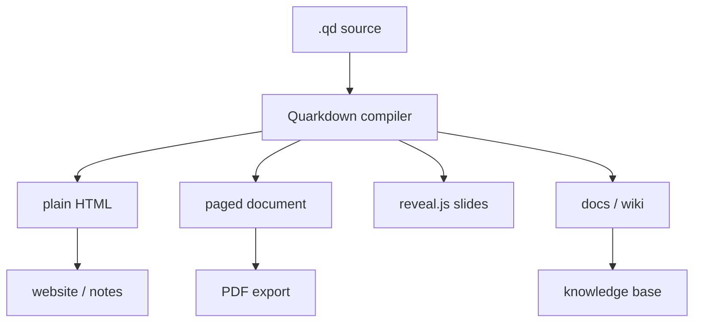

> "We shape our tools and thereafter our tools shape us." — John Culkin, *A Schoolman's Guide to Marshall McLuhan*, 1967


最近我又看了一遍 [Quarkdown](https://github.com/iamgio/quarkdown)。

这玩意乍看像是「Markdown 又一个方言」，但认真读完 README、文档、release 和仓库结构之后，我觉得它更像是在回答一个长期存在的问题，**为什么写作、排版、演示、建站，明明都在处理同一批内容，却总要换四套工具。**

Markdown 写起来舒服，但一到论文、幻灯片、复杂布局，就开始露怯。LaTeX 排版强，但语法像从另一个时代穿越过来。Typst 很现代，可它仍然更接近「新一代排版语言」。Quarkdown 的思路比较野，直接把 Markdown 扩成一个可以编程、可以换输出目标的内容系统。

不是哥们，Markdown 里写函数、条件、循环，然后一份源码出书、出 PDF、出网站、出演示，这个方向确实值得聊聊。

本文数据以 GitHub 仓库、GitHub API、Quarkdown 官方 README / docs / releases 为准，抓取时间为 **2026-05-06 16:30 左右，Asia/Shanghai**。开源项目数据会变化，后续请以仓库实时页面为准。

## 它不是编辑器，是一套内容编译系统

Quarkdown 官方给自己的定位是 **modern Markdown-based typesetting system**。它不是 Notion，不是 Obsidian 插件，也不是又一个 Markdown 预览器。更准确地说，它是一个编译器，把 `.qd` 文档编译成不同形态的产物。

官方 README 里说得很清楚，Quarkdown 允许同一个项目编译成 print-ready book、academic paper、knowledge base 或 interactive presentation。它基于 CommonMark 和 GFM 扩展出 Quarkdown Flavor，把函数调用、变量、标准库、布局构建、I/O、数学、条件语句和循环放进 Markdown 里。

我抓到的仓库数据大概是这样。

| 指标 | 数据 |
| --- | --- |
| 仓库 | [iamgio/quarkdown](https://github.com/iamgio/quarkdown) |
| 官网 | [quarkdown.com](https://quarkdown.com) |
| 创建时间 | 2024-01-30 |
| Stars | 13,774 |
| Forks | 383 |
| Open issues | 25 |
| Contributors | 21 |
| Commits | 3,385, README 页面展示值 |
| 最新 release | v2.0.1, 2026-05-04 发布 |
| 主语言 | Kotlin |
| License | GPL-3.0 |

语言占比也挺有意思。按 GitHub API 的 language bytes 粗算，Kotlin 大约占 75%，TypeScript 约 12%，SCSS 和 HTML 各约 6%。这说明它不是一个薄薄的 JS 包装层，核心逻辑确实主要在 Kotlin 里。

## 关键设计，doctype 决定内容的形态

Quarkdown 最抓人的地方，是它把输出目标放进源文件自身。

```markdown
.doctype {plain}
.doctype {paged}
.doctype {slides}
.doctype {docs}
```

官方 README 列出的目标很完整。

| doctype | 适用场景 | 背后路径 |
| --- | --- | --- |
| `plain` | 像 Notion / Obsidian 那样的连续网页、个人网站、知识管理 | HTML |
| `paged` | 论文、文章、书籍 | HTML + Paged.js，也可导出 PDF |
| `slides` | 交互式演示 | HTML + reveal.js |
| `docs` | Wiki、技术文档、大型知识库 | HTML |

PDF 不是另一个孤立世界。Quarkdown 的说法是，HTML 支持的所有 document types 和 features，在 PDF export 里也支持。这个选择很关键，它把浏览器生态、分页排版、幻灯片框架和静态文档站都串到一个内容源头上。

用一张图看，大概是这个关系。



这就是它和普通 Markdown 工具最大的差别。普通 Markdown 多半是在问，这段文本怎么渲染得好看一点。Quarkdown 问的是，**同一份内容，今天要变成哪一种媒介。**

## Markdown 被扩成了可编程语言

如果只靠 `.doctype`，Quarkdown 还只是一个多目标导出工具。真正把它和大多数 Markdown 工具拉开的，是函数系统。

官方 README 给了一个很小的例子。

```markdown
.function {greet}
    to from:
    **Hello, .to** from .from!

.greet {world} from:{iamgio}
```

输出就是 `Hello, world from iamgio!`。

这段看着简单，但含义不小。它说明 Quarkdown 不是在 Markdown 外面塞模板引擎，而是把「可复用结构」变成语言的一部分。你可以定义函数和变量，也可以依赖标准库做布局、I/O、数学、条件和循环。

这对于长文档非常要命。论文模板、讲义里的提示框、课程材料里的练习块、产品文档里的 API 卡片，只要重复出现，就会开始逼你找抽象。纯 Markdown 的答案通常是复制粘贴。复制一次还好，复制十次之后，你就知道维护地狱是什么味道了。

Quarkdown 的野心，是让 Markdown 不只表达内容，还能表达结构和生成规则。

## 它和 LaTeX、Typst 的差别

我觉得 Quarkdown 最好的对照组不是 Obsidian，而是 LaTeX 和 Typst。

LaTeX 强在学术排版生态、宏包、稳定性和历史惯性。它的问题也很明显，学习曲线陡，语法噪音大，HTML / docs / 知识库不是它的主场。Typst 则是近几年很漂亮的新答案，语法更现代，排版能力强，编译体验好，正在正面挑战 LaTeX。

Quarkdown 站的位置不太一样。它不是说「我比 LaTeX 更能排论文」，也不是说「我比 Typst 更优雅」。它更像在说，**如果你的内容不只会停在 PDF 里，那你不该被 PDF-first 的工具链绑死。**

| 工具 | 强项 | 主要代价 |
| --- | --- | --- |
| Markdown | 简单、通用、可读 | 表达复杂结构很弱 |
| LaTeX | 学术排版成熟、生态厚 | 学习曲线和语法成本高 |
| Typst | 新一代排版体验、PDF 质量好 | 仍是专门语言，知识库和网站不是核心叙事 |
| Quarkdown | Markdown 可读性 + 编程扩展 + 多目标输出 | 年轻生态、语法和工具链还要接受市场检验 |

官方 README 的 comparison 表里，Quarkdown 自己强调了几项优势，concise and readable、full document control、scripting、book/article export、presentation export、static site export、docs/wiki export。这个表当然带有项目自我陈述的立场，但方向是可信的，Quarkdown 的核心卖点确实就是「多目标内容系统」。

说实话，我不会建议一个已经深度依赖 LaTeX 宏包的实验室明天全员迁移。那不现实。但如果你正在从零搭一套课程材料、内部知识库、技术手册，或者想让一份内容同时服务「阅读、投影、打印、发布」，Quarkdown 的思路就很香。

## v2.0.1 看起来不像玩具项目

最新 release 是 [v2.0.1](https://github.com/iamgio/quarkdown/releases/tag/v2.0.1)，发布时间是 2026-05-04。

这版没有那种「改变世界」式的大功能，但它透露出项目已经在处理真实使用中的边角问题。新增的 `--timeout` 参数可以限制整次程序执行时间，默认 30 秒，`0` 表示关闭限制。新建 docs 项目时，左上角标题会链接到 root document。Quarkdoc 多行签名里多余的反斜杠展示问题也被修了。还新增了波兰语、葡萄牙语、俄语、乌克兰语 locale。

这些听上去都不是特别性感。

但我反而挺看重这种 release。因为一个内容编译器真正难的地方，往往不是 demo 页面里那张漂亮海报，而是各种操作系统、各种项目结构、各种导出目标、各种边界输入下能不能持续工作。`--timeout` 这种东西，看着小，背后是「有人真的把它跑在自动化流程里」。

安装路径也比较完整。官方 README 给了 Linux / macOS install script、Homebrew、Windows PowerShell、Scoop、GitHub Actions 和手动安装。手动安装要求 Java 17 以上，PDF 导出还需要 Node.js、npm、Puppeteer。这里也能看到它的技术路线，核心在 JVM，最终输出大量借力 Web 生态。

## 我最在意的三个使用场景

第一个是课程材料。

一套课程内容，天然有三种形态。老师备课需要讲义，课堂需要 slides，学生课后需要网页和 PDF。过去这些东西经常被拆成 PPT、Word、Markdown、Notion 四份。版本一多，改一个概念就开始漏。Quarkdown 这种单源多输出，如果跑通了，会非常适合课程型内容。

第二个是开源项目文档。

很多项目的 README、Wiki、官网、API 文档、发布说明彼此割裂。开发者其实不是不想写文档，是不想在四个地方维护同一段话。Quarkdown 的 `docs` 目标，加上函数和标准库，理论上可以把「文档站」和「可打印手册」放到同一个源头里。

第三个是个人知识库。

这块我有点私心。现在很多知识库工具都很舒服，但一旦你想把内容拿出来，做成书、做成网站、做成演示，迁移成本就上来了。Quarkdown 如果能保持文本源文件友好，它就有一种很朴素的长期价值，**内容不被某个编辑器绑架。**

当然，现实里还得看编辑体验。官方提到了 live preview、fast compilation speed 和 VS Code extension。对这类工具来说，语法再漂亮，如果预览慢、报错难懂、插件不好用，用户还是会跑。

## 风险也挺明确

Quarkdown 现在最需要警惕的，不是方向错，而是方向太大。

它同时想做排版、脚本语言、标准库、静态站、文档站、演示、PDF 导出、VS Code 扩展。每个方向单独拿出来，都够一个团队忙很久。现在仓库虽然已经有 13k+ stars，但核心贡献仍明显集中在作者 iamgio 身上，GitHub API 显示他贡献数远高于其他贡献者。

这不是批评，很多优秀开源项目一开始都是这样。但对于采用者来说，这就是风险信号。你可以试用，可以在个人项目里重度探索，但如果要放进公司核心文档流水线，至少要评估三件事。

第一，语法稳定性。现在写下的 `.qd` 文件，未来版本升级会不会大面积改。第二，生态成熟度。模板、示例、社区问答、CI 集成能不能支撑团队协作。第三，许可证。仓库标的是 GPL-3.0，企业内部集成和分发前最好让法务或懂开源合规的人看一眼。

我自己的判断是，Quarkdown 很值得关注，也很值得在非关键链路里试用。但它还没到「闭眼替换现有文档系统」的阶段。

## 回到写作这件小事

工具最后都会回到人的手上。

我喜欢 Quarkdown 的地方，不只是它能导出很多格式，而是它承认了一件事，**写作不是只有写字。** 写论文时你在组织论证，做演示时你在设计节奏，建知识库时你在安排导航，出 PDF 时你在关心分页和版面。这些工作看似不同，其实都围绕同一批内容展开。

传统工具链把这些动作切碎了。Quarkdown 试图把它们重新缝到一个源码里。

这件事能不能成，我不知道。但这个方向我很喜欢。因为它把 Markdown 从「轻量标记」往前推了一步，变成一种更接近内容工程的东西。不是所有人都需要它，但每一个长期写教程、做文档、维护知识库的人，都应该看一眼。

说到底，我们塑造工具，工具也会反过来塑造我们。

如果一个工具能让你少维护三份重复内容，多花一点时间打磨真正的想法，它就已经改变了写作的重心。

> **璞奇启示**
>
> 1. 做学习内容时，尽量让「知识源」和「展示形态」分离，同一份材料可以变成练习、讲义、演示和复习页，重复维护越少，迭代越快。
> 2. 评估新工具不要只看 demo，要看 release 里修了什么小问题。真正进入工作流的工具，最后拼的是边界场景和长期维护。
> 3. 对学习产品来说，内容格式不是后台细节。格式决定内容能否被拆题、复用、追踪和再生成，Quarkdown 这类项目值得当成「内容工程」样本观察。

资料来源，GitHub 仓库与 README：[iamgio/quarkdown](https://github.com/iamgio/quarkdown)；官方文档：[quarkdown.com/docs](https://quarkdown.com/docs/)；最新版说明：[v2.0.1 release](https://github.com/iamgio/quarkdown/releases/tag/v2.0.1)。数据抓取时间为 2026-05-06 16:30 左右，Asia/Shanghai。
